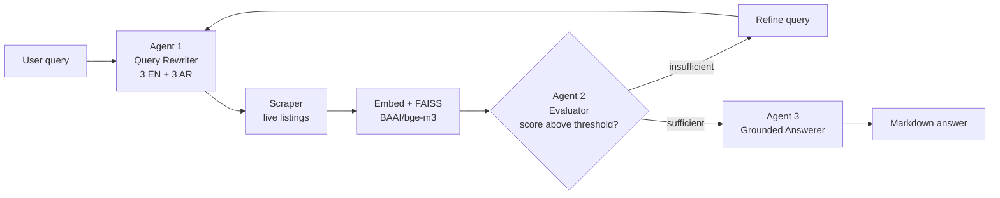

# Deep Search: Multi-Agent RAG Shopping Assistant

A retrieval-augmented shopping assistant built as a **three-agent loop** rather than a
single RAG chain. It expands one vague query into six bilingual search queries, retrieves
live product listings, **gates them on relevance before generating**, and retries with a
refined query when the evidence is not good enough.

<p align="left">
  
  
  
  
  
</p>

---

## The problem

Marketplace search is keyword-matched and monolingual. A shopper who types
*"cheap laptop for school"* gets whatever listings happen to contain those tokens, missing
the Arabic-language listings entirely, with no notion of whether the results actually
answer the question.

Bolting an LLM onto that does not fix it. If retrieval returns six irrelevant products, a
naive RAG pipeline will summarise six irrelevant products fluently and confidently.

## The approach

Three agents with a feedback edge between retrieval and generation:



| Stage | What it does | Why it is there |
|---|---|---|
| **Agent 1, Rewriter** | One query becomes 3 English and 3 Arabic paraphrases, then filler and geography terms are stripped | Recall. Arabic rewrites reach listings an English query never surfaces |
| **Retrieval** | Scrapes search results and product pages for every rewritten query | Live data, with no stale product index to maintain |
| **Embed + FAISS** | `BAAI/bge-m3` into a normalised inner-product index | A multilingual encoder puts EN and AR in *one* vector space, so Arabic rewrites can rank English listings |
| **Agent 2, Evaluator** | Language-aware similarity threshold, dedup by ASIN, keeps best score per product | **The critical piece.** Refuses to pass weak evidence to the generator |
| **Agent 3, Answerer** | Builds a deterministic summary, then has the LLM polish it | Grounding. The model rewrites facts instead of inventing them |

## Retrieval accuracy

Measured against a fixed catalogue with the real encoder and index. No API key needed,
since this exercises the retrieval core rather than the LLM agents.

| Query | Language | Top result | Correct |
|---|---|---|---|
| cheap laptop for school | EN | HP 15 Budget Laptop | yes |
| laptop for video editing | EN | Dell XPS 15 Workstation | yes |
| noise cancelling headphones travel | EN | Anker Soundcore Q30 | yes |
| running shoes | EN | Nike Air Zoom | yes |
| smartphone with good camera | EN | Samsung Galaxy A54 | yes |
| مكنسة كهربائية صغيرة للسيارة | AR | Portable Car Vacuum 12V | yes |
| لابتوب رخيص للدراسة | AR | Lenovo IdeaPad Slim 3 | yes |
| سماعات بلوتوث | AR | Anker Soundcore Q30 | yes |

**Top-1 accuracy 8/8.** Arabic queries correctly retrieve English listings, which is the
cross-language behaviour the encoder was chosen for.

The relevance gate behaves correctly at the boundary too. `cheap laptop for school` keeps
2 products; `industrial welding equipment`, which nothing in the catalogue matches, keeps
**0** and triggers a retry rather than an answer built on noise.

## The threshold was biased against Arabic

Testing surfaced a real defect in the original design. Agent 1 emits three English and
three Arabic rewrites, and the notebook scored all six against one fixed `0.54` threshold.
Measured on ten matched query pairs meaning the same thing, against the same English
product text:

| | Mean similarity to the correct product |
|---|---:|
| English queries | 0.678 |
| Arabic queries | 0.571 |
| **Gap** | **0.107** |

Arabic scores lower not because the retrieval is worse, but because the shared embedding
space is not perfectly isotropic across scripts when the catalogue text is English. The
consequence at a single fixed bar:

| Threshold | English passes | Arabic passes |
|---|---:|---:|
| 0.50 | 10/10 | 9/10 |
| **0.54** | **10/10** | **7/10** |
| 0.58 | 9/10 | 4/10 |

**The gate was discarding 30% of valid Arabic hits**, silently defeating the bilingual
expansion that is the pipeline's main idea. `سماعات بلوتوث` scored 0.530 and was thrown
away for missing the bar by 0.01.

The fix is a script-aware threshold: Arabic queries are judged against
`threshold - ARABIC_THRESHOLD_OFFSET`. With the measured 0.11 offset applied, Arabic
passes 10/10 at 0.54 while the English bar is untouched.

The offset is a property of the encoder and catalogue language, not a universal constant,
so it is **measured rather than guessed**:

```bash
python scripts/calibrate_threshold.py    # prints the gap and the setting to use
```

Script detection is a majority test over letters, not "contains any Arabic character", so
a mostly English query naming an Arabic brand is still judged as English.

## Other design decisions

**Normalised vectors with `IndexFlatIP`.** Embeddings are L2-normalised at encode time, so
inner product is cosine similarity. Scores land in an interpretable range, which is what
makes a threshold meaningful rather than arbitrary.

**The evaluator is a gate, not a ranker.** It can return an empty list, and an empty list
is a valid, useful outcome. It triggers a retry instead of a hallucinated answer.

**Generation degrades to the deterministic summary.** `format_products()` produces a
complete, correct answer with no LLM involved. The Cohere call only makes it read better.
If that call fails, the user still gets the facts.

**Dedup keeps the max score, not the first.** A product surfacing across several rewritten
queries is a strong relevance signal and should be ranked by its best evidence, not by
whichever query happened to run first.

## Quickstart

```bash
git clone https://github.com/yasmine-ali101/deepsearch-shopping-agent.git
cd deepsearch-shopping-agent

python -m venv .venv && source .venv/bin/activate   # Windows: .venv\Scripts\activate
pip install -r requirements.txt

cp .env.example .env        # then add your Cohere key
python -m deepsearch.app    # launches the Gradio UI
```

> First run downloads the `bge-m3` encoder, roughly 2 GB. Get a free Cohere key at
> [dashboard.cohere.com](https://dashboard.cohere.com/api-keys).

### Use it as a library

```python
from deepsearch import ShoppingPipeline

result = ShoppingPipeline().run("cheap laptop for school", country="eg")

print(result.answer)        # markdown answer
print(result.rounds_used)   # how many retrieval rounds it took
print(len(result.products)) # products that passed the relevance gate
```

## Configuration

Every knob is an environment variable with a sane default. See [`.env.example`](.env.example).

| Variable | Default | Effect |
|---|---|---|
| `COHERE_API_KEY` | *(required)* | Auth for Agents 1 and 3 |
| `RELEVANCE_THRESHOLD` | `0.54` | Raise for precision, lower for recall |
| `ARABIC_THRESHOLD_OFFSET` | `0.11` | How much lower the Arabic bar sits. Measured, not guessed |
| `TOP_K_PER_QUERY` | `3` | Candidates retrieved per rewritten query |
| `MAX_ROUNDS` | `3` | Retry budget before giving up |
| `AMAZON_COUNTRY` | `eg` | Marketplace TLD |
| `SCRAPE_DELAY_SECONDS` | `1.5` | Politeness delay between requests |

## Tests

```bash
pip install pytest && pytest      # 21 tests
```

Covers the relevance gate, the language-aware threshold, and the agentic retry loop. All
I/O is stubbed, so the suite needs no API key, no network, and no model download.

## Project structure

```
src/deepsearch/
├── config.py              # env-driven settings, no hardcoded secrets
├── models.py              # the Product type, dependency free
├── pipeline.py            # the agentic loop and retry logic
├── app.py                 # Gradio UI
├── agents/
│   ├── query_rewriter.py  # Agent 1, bilingual expansion and cleaning
│   ├── evaluator.py       # Agent 2, language-aware relevance gate
│   └── answerer.py        # Agent 3, grounded generation
└── retrieval/
    ├── scraper.py         # marketplace scraping
    └── index.py           # embeddings and FAISS
scripts/calibrate_threshold.py   # measures the EN/AR scoring gap
tests/                           # 21 offline tests
notebooks/                       # original research notebook
```

## Limitations

Stated plainly, because they bound what this project demonstrates:

- **Scraping is fragile and restricted by terms of service.** Amazon rotates its markup and
  blocks automated traffic. The scraper detects CAPTCHAs and backs off rather than evading
  them, and reads public search pages only. **For any non-coursework use, swap in the
  Product Advertising API or a licensed data provider.** `retrieval/scraper.py` is isolated
  behind the `Product` dataclass specifically so it can be replaced.
- **Retrieval accuracy is measured on a 10-product catalogue.** 8/8 top-1 demonstrates the
  encoder and index work as intended. It is not a benchmark, and precision@k over a large
  labelled set would be the real evaluation.
- **The `0.54` base threshold is still tuned by inspection.** Only the *Arabic offset* is
  measured. The base bar itself would need a labelled relevance set to justify.
- **Retries refine the query heuristically.** A stronger design would feed Agent 2's
  *reason* for rejection back to Agent 1 rather than appending a generic hint.
- **The index is rebuilt per round.** Fine at this scale, but a persistent store would be
  needed for a real catalogue.

## Attribution

Built as a group project for the **BARQ** AI program by **Ahmed Haitham, Faisal, Sherif,
and Yasmine Ali**. This repository is the productionised refactor, covering packaging,
secret management, error handling, the language-aware threshold, tests, and documentation,
of our shared research notebook, which is preserved in [`notebooks/`](notebooks/).

## License

[MIT](LICENSE)
