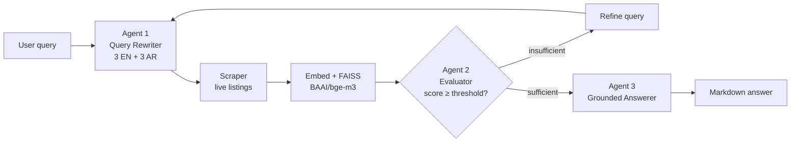

# Deep Search — Multi-Agent RAG Shopping Assistant

A retrieval-augmented shopping assistant built as a **three-agent loop** rather than a
single RAG chain. It expands one vague query into six bilingual search queries, retrieves
live product listings, **gates them on relevance before generating**, and retries with a
refined query when the evidence isn't good enough.

<p align="left">
  
  
  
  
  
</p>

---

## The problem

Marketplace search is keyword-matched and monolingual. A shopper who types
*"cheap laptop for school"* gets whatever listings happen to contain those tokens —
missing the Arabic-language listings entirely, and with no notion of whether the
results actually answer the question.

Bolting an LLM onto that doesn't fix it. If retrieval returns six irrelevant products,
a naive RAG pipeline will summarise six irrelevant products fluently and confidently.

## The approach

Three agents with a feedback edge between retrieval and generation:



| Stage | What it does | Why it's there |
|---|---|---|
| **Agent 1 — Rewriter** | One query → 3 English + 3 Arabic paraphrases, then strips filler and geography terms | Recall. Arabic rewrites reach listings an English query never surfaces |
| **Retrieval** | Scrapes search results + product pages for every rewritten query | Live data; no stale product index to maintain |
| **Embed + FAISS** | `BAAI/bge-m3` into a normalised inner-product index | Multilingual encoder puts EN and AR in *one* vector space, so Arabic rewrites can rank English listings and vice versa |
| **Agent 2 — Evaluator** | Cosine-similarity threshold, dedup by ASIN, keeps best score per product | **The critical piece.** Refuses to pass weak evidence to the generator |
| **Agent 3 — Answerer** | Builds a deterministic summary, then has the LLM polish it | Grounding: the model rewrites facts instead of inventing them |

### Design decisions worth calling out

**Normalised vectors + `IndexFlatIP`.** Embeddings are L2-normalised at encode time, so
inner product *is* cosine similarity. Scores land in an interpretable `[-1, 1]` range,
which is what makes a fixed threshold like `0.54` meaningful rather than arbitrary.

**The evaluator is a gate, not a ranker.** It can return an empty list, and an empty
list is a valid, useful outcome — it triggers a retry instead of a hallucinated answer.

**Generation degrades to the deterministic summary.** `format_products()` produces a
complete, correct answer with no LLM involved. The Cohere call only makes it read
better; if that call fails, the user still gets the facts.

**Dedup keeps the max score, not the first.** A product surfacing across several
rewritten queries is a strong relevance signal — it should be ranked by its best
evidence, not whichever query happened to run first.

## Quickstart

```bash
git clone https://github.com/yasmine-ali101/deepsearch-shopping-agent.git
cd deepsearch-shopping-agent

python -m venv .venv && source .venv/bin/activate   # Windows: .venv\Scripts\activate
pip install -r requirements.txt

cp .env.example .env        # then add your Cohere key
python -m deepsearch.app    # launches the Gradio UI
```

> First run downloads the `bge-m3` encoder (~2 GB). Get a free Cohere key at
> [dashboard.cohere.com](https://dashboard.cohere.com/api-keys).

### Use it as a library

```python
from deepsearch import ShoppingPipeline

result = ShoppingPipeline().run("cheap laptop for school", country="eg")

print(result.answer)        # markdown answer
print(result.rounds_used)   # how many retrieval rounds it took
print(len(result.products)) # products that passed the relevance gate
```

## Configuration

Every knob is an environment variable with a sane default — see [`.env.example`](.env.example).

| Variable | Default | Effect |
|---|---|---|
| `COHERE_API_KEY` | *(required)* | Auth for Agents 1 and 3 |
| `RELEVANCE_THRESHOLD` | `0.54` | Raise for precision, lower for recall |
| `TOP_K_PER_QUERY` | `3` | Candidates retrieved per rewritten query |
| `MAX_ROUNDS` | `3` | Retry budget before giving up |
| `AMAZON_COUNTRY` | `eg` | Marketplace TLD (`eg`, `sa`, `ae`, `com`, `co.uk`) |
| `SCRAPE_DELAY_SECONDS` | `1.5` | Politeness delay between requests |

## Tests

```bash
pip install pytest && pytest
```

Covers the relevance gate (thresholding, FAISS `-1` padding, dedup-by-max-score) and the
agentic retry loop. All I/O is stubbed — the suite needs no API key, no network, and no
model download.

## Project structure

```
src/deepsearch/
├── config.py              # env-driven settings; no hardcoded secrets
├── pipeline.py            # the agentic loop + retry logic
├── app.py                 # Gradio UI
├── agents/
│   ├── query_rewriter.py  # Agent 1 — bilingual expansion + cleaning
│   ├── evaluator.py       # Agent 2 — relevance gate
│   └── answerer.py        # Agent 3 — grounded generation
└── retrieval/
    ├── scraper.py         # marketplace scraping
    └── index.py           # embeddings + FAISS
tests/                     # offline tests for the gate and the loop
notebooks/                 # original research notebook
```

## Limitations

Stated plainly, because they bound what this project demonstrates:

- **Scraping is fragile and ToS-restricted.** Amazon rotates its markup and blocks
  automated traffic; the scraper detects CAPTCHAs and backs off rather than evading them.
  It reads public search pages only. **For any non-coursework use, swap in the Product
  Advertising API or a licensed data provider** — `retrieval/scraper.py` is isolated
  behind the `Product` dataclass specifically so it can be replaced.
- **The `0.54` threshold was tuned by inspection**, not on a labelled relevance set. It's
  a reasonable default for this encoder, not a validated optimum. A proper evaluation
  (precision@k over human-labelled query/product pairs) is the obvious next step.
- **Retries refine the query heuristically.** A stronger design would feed Agent 2's
  *reason* for rejection back to Agent 1 rather than appending a generic hint.
- **The index is rebuilt per round.** Fine at this scale (tens of products); a persistent
  store would be needed for a real catalogue.

## Attribution

Built as a group project for the **BARQ** AI program by **Ahmed Haitham, Faisal, Sherif,
and Yasmine Ali**. This repository is the productionised refactor — packaging, secret
management, error handling, tests, and documentation — of our shared research notebook,
which is preserved in [`notebooks/`](notebooks/).

## License

[MIT](LICENSE)
